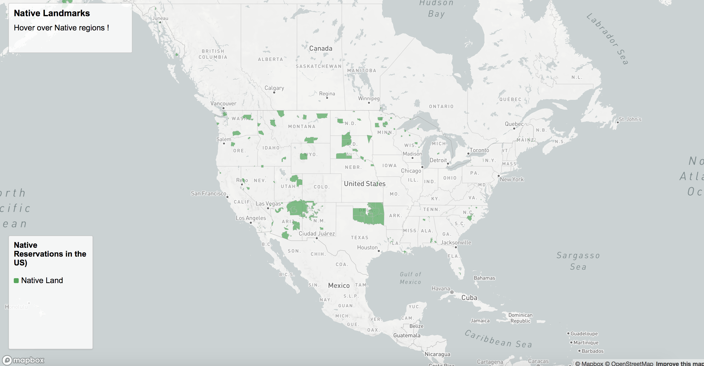
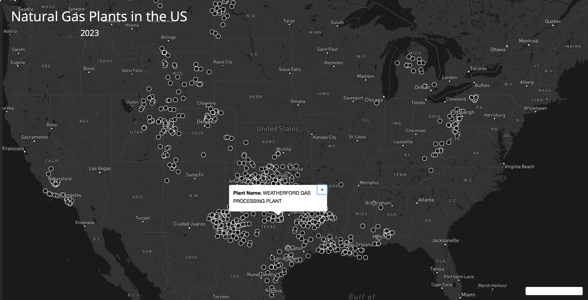

Natural Gas plants Across the U.S. near Native Reservations

link : 1samrag.github.io/lab3
<a href="https://github.com/1samrag/lab3">1samrag.github.io/lab3</a>

Contributors: Samra Gebrehiwot 

Project description: This webmap displays different Indian reservations throughout the United States, we can identify the native sites closest to natural gas plants. The United States census bureau offers hapefiles for each of the native reservation across the US, using such data we can identify where each location is and refrence the dot density map depicting gas plants across the U.S. 

One or two screenshots to illustrate the project's functions
NativeSites 
GasPlantSites 

Project goal :
This webmap is designed to reach environmental activists and native residents who are concerned for the well being of sacred land. A map with symbols at each reservation location with symbols for gas plants will make native territory and its proximity to gas plants identifiable.

Data sources:
Primary data source for crime statistics comes from the city of Seattle at https://www.census.gov/tribal/

Shapefiles for each Native Reservation from:
https://www.census.gov/geographies/mapping-files/time-series/geo/tiger-line-file.html 
https://www.geoplatform.gov/metadata/3e2ba754-daae-5ef7-9a05-9ed8387fb085
https://catalog.data.gov/dataset tiger-line-shapefile-2018-nation-u-s-current-american-indian-alaska-native-native-hawaiian-area

Shapefiles for Gas Plants across the United States:
https://www.eia.gov/maps/layer_info-m.php 

Applied libraries (Mapbox) and Web Services in use (github, basemap).

Acknowledgment:
Steven Bao