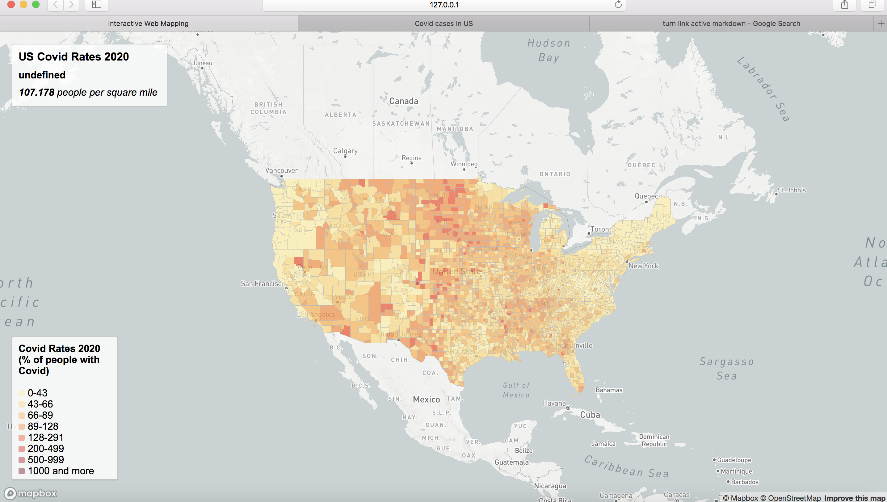
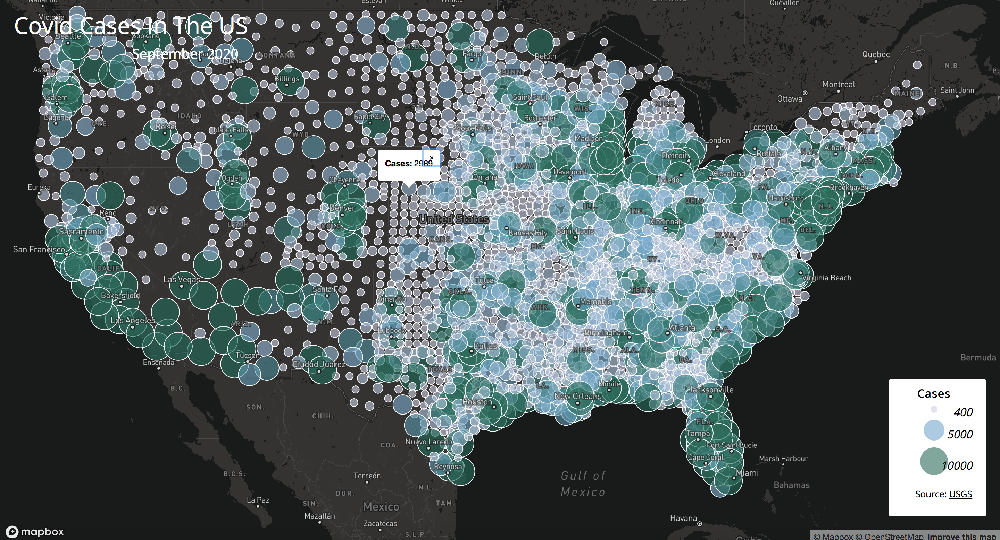

write up a project description in the readme.md file. This file will introduce the project name, a brief introduction, links to the map, screenshots, the primary functions(especially the function which was not covered in the lectures), libraries in use, data sources, credit, acknowledgment, and other necessary information. (6 points)

In This project we created a chloropleth map of Covid rates in the year 2020. We made a second map depicting the porportional values of Covid counts in 2020. 

  [map1](map1.html)
  [map2](map2.html)

screenshot 
screenshot 

The primary function for each map is to turn raw data into tangible information on the prevelant problem the world is facing, Covid-19.

libraries in use mapbox
data sources- New York times and census data
credit- Samra Gebrehiwot
acknowledgment- Steven Bao who worked with me through this lab.