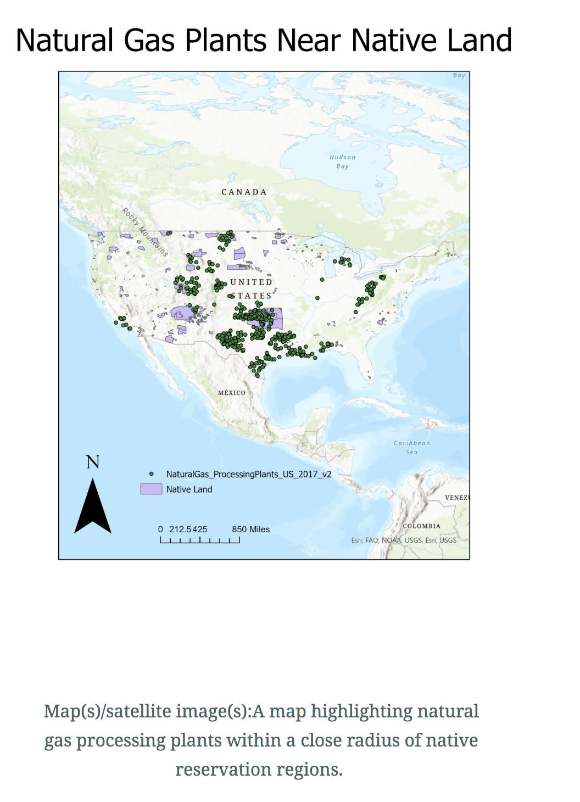
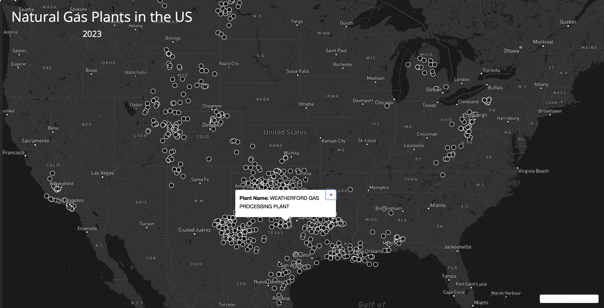
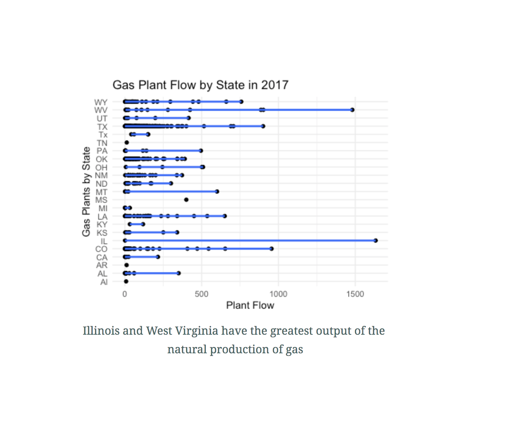
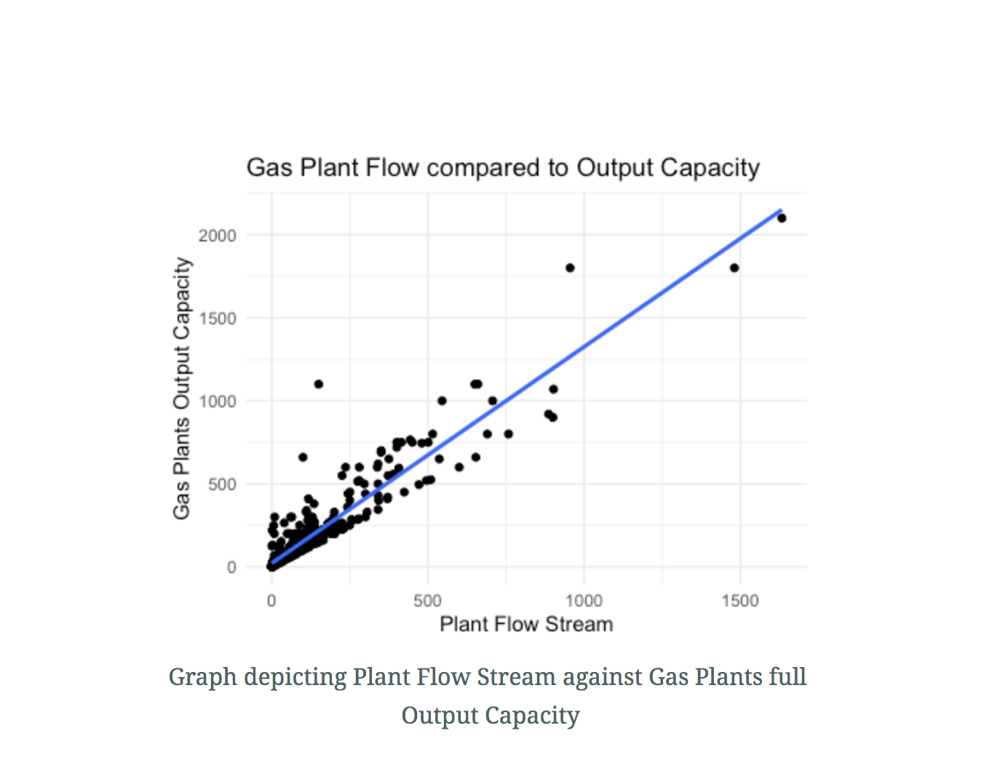

<!DOCTYPE html>
<html>
  <head>
  </head>
  <body>
    <h1> Native American Reservation Lands within close proximity of Gas Processing Plants within the U.S.</h1>
    
link : 1samrag.github.io/lab3
<a href="https://github.com/1samrag/lab3">1samrag.github.io/lab3</a>

Contributors: Samra Gebrehiwot 

Project description: This webmap displays different Indian reservations throughout the United States, we can identify the native sites closest to natural gas plants. The United States census bureau offers hapefiles for each of the native reservation across the US, using such data we can identify where each location is and refrence the dot density map depicting gas plants across the U.S. 

There are 566 federally recognized Indian tribes in the U.S, and there are 325 Native American reservations. The Census Bureau provides statistics for 618 regions. I can use data from government websites to determine the proximity of these power plants to native lands. People who live in close proximity to  gas plants are at higher risk of being exposed to radiation which can lead to long-term health effects like cancer. Radioactive materials can leech into the air and enter the body if people breathe it in. It can also contaminate bodies of water and crops near by. 

Research question:  Which Native reservations are susceptible to the dangers being in close proximity of gas plants? According to the map I created below, there is a lot of overlap down the Central most path on the US map in. Specifically along the Mississippi river on the bordering states between Montana and North Dakota. We also observe two more large clusters of overlap in the midwest around Colorado.  And Lastly, near the Southern most part of Texas and Oklahoma state.

Data generated from QGIS

With over half of Oklahoma being considered Native territory it is important to look at gas production industries in Oklahoma. Oklahoma is the US's top oil producing state ranking 4th in the nation. One fourth of Oklahoma's oil and gas wells are at 60%  if its refinery capacity and its operations are located in native territory. Its gas wells lie within five native tribes including the Cherokee, Chickasaw, Choctaw, Creek and Seminole. The fracking pioneer Chesapeake Energy(One of Oklahoma's biggest energy firms), has  declared bankruptcy  due to Oklahoma's high extraction costs. Due to a great deal of Oklahoma being Native land, this generates greater regulation over the sacred land serving to protect its properties and wildlife. In addition to federal restrictions, in order to protect  endangered wildlife like, the beetle , drilling in Indian country is closely monitored. This can sometimes cause delays in gas production for other miners. A legislative proposal was agreed upon allowing native american groups the freedom to collect taxes and grant them authority over their lands and any activity they deem hazardous to the endangerment of the natural welfare of the tribes on the land which may include environmental regulation. This opens the door to double taxation from the federal government and additionally native lands in which gas production is being done on. 

Environmental advocates are joining with Native American groups to fight against and sue to prevent pipeline projects from destroying the environment. In particular the Dakota Access pipeline in North Dakota. In 2011, the Chickasaw and Choctaw tribes sued and won a settlement against Oklahoma for blocking off the water from Sardis Lake.

Screenshot of Project Funciton:
NativeSites 
GasPlantSites 

Statistics charts:

Ilinois and West Virginia are the two areas with the highest output of production of natural gas. The indigenous land nearest these two plants resides in Michigan and is comprised of  three main Anishinaabe nations: Ojibwe (Chippewa), Odawa (Ottawa), and Bodewadomi (Potawatomi), and these three tribes form what is called "The Council of The Three Fires"

Almost all point on the graph for Plant Flow Stream cluster around the black line indicating that most Natural Gas production Plants are producing at full capacity

Project goal :
This webmap is designed to reach environmental activists and native residents who are concerned for the well being of sacred land. A map with symbols at each reservation location with symbols for gas plants will make native territory and its proximity to gas plants identifiable.

Conclusion: Gas plants in native territory are granted permission to regulate the land and all of its needs, this however poses issues for the many industries whose oil pumps through native regions. Individuals from the industry like a Manager from the research firm of “ClearView Energy Partners” believes this new proposal creates obstacles to the already clear route of government oversight. This may pose conflict for those in the field. Oil producers are left to feel all the uncertainty when deciding where to drill for oil. Investors of oil companies may be less drawn to projects and drilling near native regions to avoid additional regulations. 

Data sources:
Primary data source for crime statistics comes from the city of Seattle at https://www.census.gov/tribal/

Shapefiles for each Native Reservation from:
https://www.census.gov/geographies/mapping-files/time-series/geo/tiger-line-file.html 
https://www.geoplatform.gov/metadata/3e2ba754-daae-5ef7-9a05-9ed8387fb085
https://catalog.data.gov/dataset tiger-line-shapefile-2018-nation-u-s-current-american-indian-alaska-native-native-hawaiian-area

Shapefiles for Gas Plants across the United States:
https://www.eia.gov/maps/layer_info-m.php 

Applied libraries (Mapbox) and Web Services in use (github, basemap).

Acknowledgment:
Steven Bao
  </body>
</html> 
 
 

